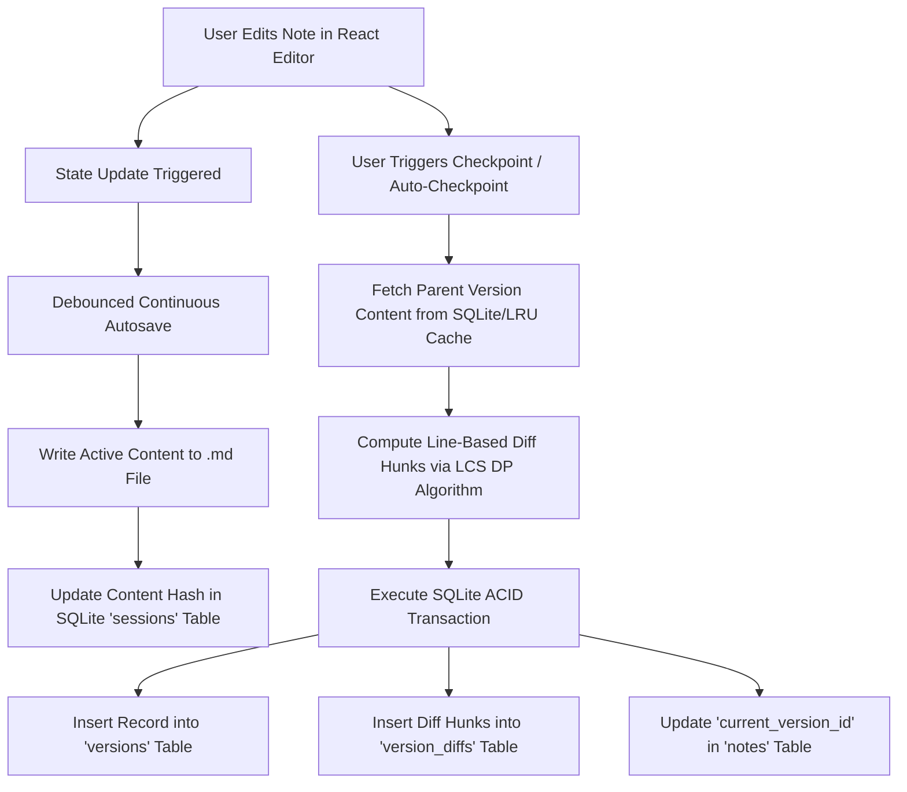
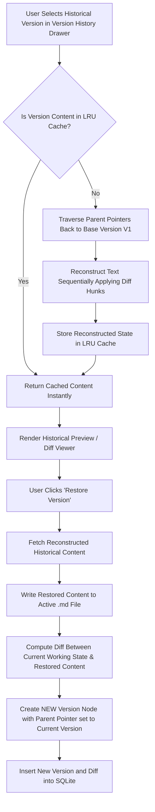
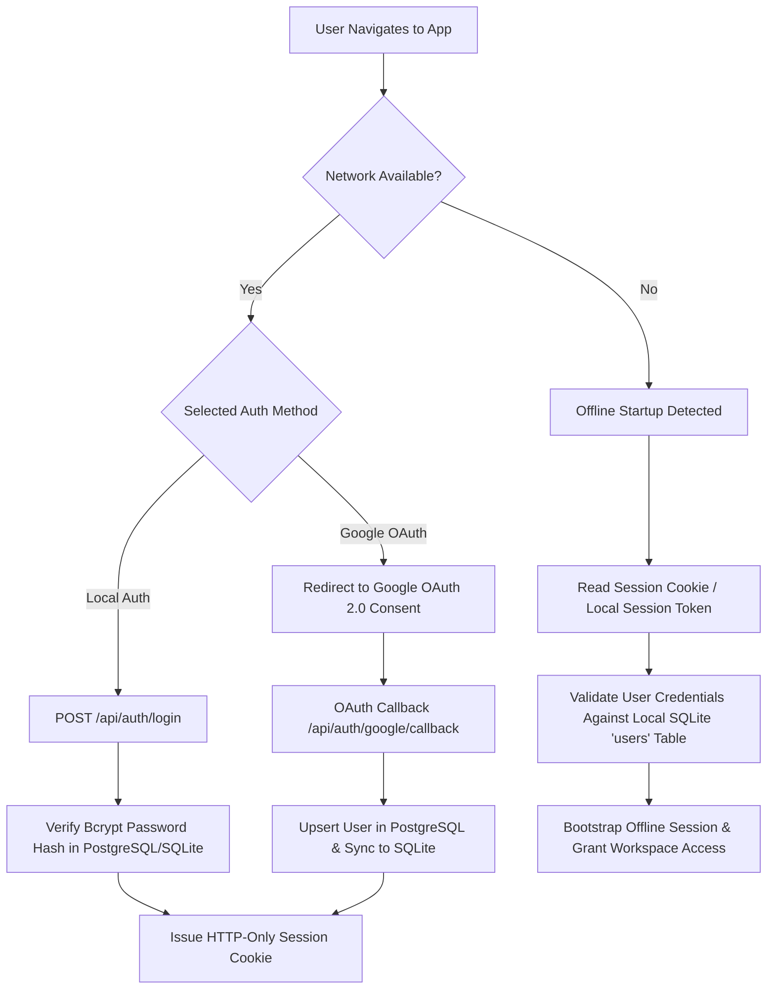
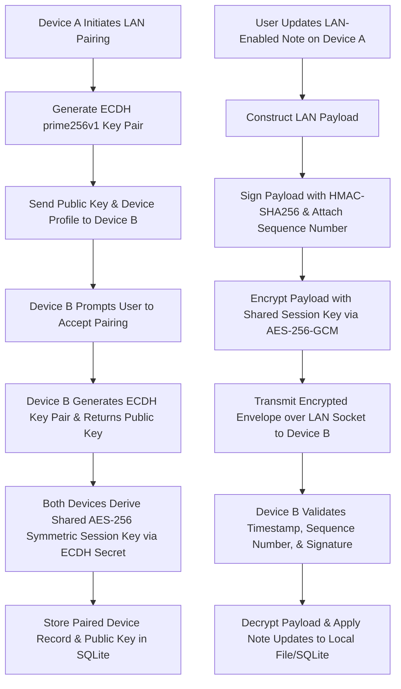

# SYNCNOTE – An Offline-First Markdown Note-Taking and Synchronization Application

> **Final Year Major Project Report**  
> **Degree Program:** Bachelor of Technology / Master of Technology in Computer Science & Engineering  

---

## TABLE OF CONTENTS

- [Abstract](#abstract)
- [Acknowledgement](#acknowledgement)
- [Table of Contents](#table-of-contents)
- [List of Figures](#list-of-figures)
- [1. Introduction](#1-introduction)
  - [1.1 Background](#11-background)
  - [1.2 Purpose](#12-purpose)
  - [1.3 Objectives](#13-objectives)
- [2. Literature Review](#2-literature-review)
- [3. Existing System and Proposed System](#3-existing-system-and-proposed-system)
  - [3.1 Existing System](#31-existing-system)
  - [3.2 Proposed System](#32-proposed-system)
- [4. System Requirements](#4-system-requirements)
  - [4.1 Hardware Requirements](#41-hardware-requirements)
  - [4.2 Software Requirements](#42-software-requirements)
  - [4.3 Functional Requirements](#43-functional-requirements)
  - [4.4 Non-Functional Requirements](#44-non-functional-requirements)
- [5. System Architecture](#5-system-architecture)
  - [5.1 System Design](#51-system-design)
  - [5.2 Flow Diagram](#52-flow-diagram)
- [6. Implementation](#6-implementation)
- [7. Testing](#7-testing)
- [8. Screenshots](#8-screenshots)
- [Conclusion and Future Enhancements](#conclusion-and-future-enhancements)
- [References](#references)

---

## ABSTRACT

Traditional digital note-taking applications heavily depend on centralized cloud infrastructure and persistent internet connectivity. This architectural reliance introduces significant challenges, including remote service latency, potential service outages, data lock-in through proprietary storage formats, and user privacy risks. When network connectivity is lost, cloud-dependent platforms frequently restrict note accessibility, edit verification, and historical tracking.

To mitigate these limitations, this project presents **SyncNote**, an offline-first Markdown note-taking and knowledge-management application. SyncNote prioritizes local data sovereignty by storing working note content directly as standard Markdown (`.md`) files on the user's local filesystem. Local application metadata, notebook organizational hierarchies, session states, and version control histories are indexed using an embedded SQLite database. For global knowledge representation, SyncNote parses bidirectional WikiLinks (`[[Note Title]]`) to generate an interactive, node-link graph visualization of note relationships.

SyncNote incorporates a custom, lightweight version-control engine inspired by Git concepts. Rather than duplicating full Markdown snapshots for every document edit, the engine maintains linear version history chains using line-based diff hunks, parent version pointers, and SHA-256 content hashes. Autosaving updates the active Markdown file continuously, whereas checkpoints create immutable version entries. Reconstructing historical states involves traversing ancestor version trees and applying diff hunks sequentially, while restoring a previous state safely records a new checkpoint without destroying existing version history.

Multi-device interoperability is achieved through a dual-synchronization architecture supporting both Online/Cloud Sync and Local Area Network (LAN) Sync. User identity and central device registries are managed via a Node.js/Express backend coupled with PostgreSQL and Google OAuth authentication. For privacy-sensitive data, LAN Sync enables direct device-to-device synchronization using Elliptic-Curve Diffie-Hellman (ECDH) key exchange, AES-256-GCM symmetric encryption, digital signatures, and sequence-based replay protection. Users maintain granular control by specifying synchronization modes on a per-note basis.

The primary goal of SyncNote is to provide a privacy-oriented, resilient, and performant knowledge-management system that functions seamlessly without network connectivity while offering optional, cryptographically secure synchronization across authorized devices.

---

## ACKNOWLEDGEMENT

The successful completion of this major project report on **"SYNCNOTE – An Offline-First Markdown Note-Taking and Synchronization Application"** required guidance, technical advice, and support from various individuals.

We express our sincere gratitude to our project guide, **[Guide Name]**, **[Department]**, for providing valuable guidance, constructive feedback, and continuous encouragement throughout the conceptualization, system design, and implementation stages of this project.

We extend our deep appreciation to the Head of the Department, **[Department]**, and the faculty members of **[Institution Name]** for providing the academic environment, computational infrastructure, and resources necessary to execute this research and development work.

Finally, we acknowledge our peers and classmates for their insightful discussions and testing assistance during system evaluation.

**[Author Name(s)]**  
Department of Computer Science & Engineering  
[Institution Name]  

---

## LIST OF FIGURES

- **Figure 1: SyncNote System Architecture** — Layered block diagram illustrating Presentation, Application, Central Auth, Local Storage, File System, and Dual Sync layers.
- **Figure 2: SyncNote Application Flow** — End-to-end operational flow of user actions, state transitions, and background sync task management.
- **Figure 3: Authentication Flow** — Dual authentication lifecycle diagram covering credential hashing, Google OAuth 2.0 callback handling, session cookie generation, and offline session bootstrapping.
- **Figure 4: Note Storage Architecture** — Structural relationship between local `.md` files, SQLite metadata indexing, and PostgreSQL central user registry.
- **Figure 5: Version Control Workflow** — Lifecycle of editor modifications, continuous file autosave, explicit checkpoint generation, and line-based diff computation.
- **Figure 6: Linear Version History** — Graph representation of parent-child version pointers, SHA-256 content hash verification, and non-destructive version restoration.
- **Figure 7: Online Synchronization Flow** — Cloud synchronization pipeline showing local sync queue enqueueing, coalescing, API payload dispatch, and PostgreSQL record updating.
- **Figure 8: LAN Device Pairing and Synchronization** — Peer-to-peer device discovery, ECDH key agreement, AES-256-GCM payload encryption, HMAC signature validation, and replay protection.
- **Figure 9: Notes and Notebook Interface** — Structural visual representation of the sidebar navigation, folder tree hierarchy, and note list view.
- **Figure 10: Markdown Note Editor** — Visual representation of the dual-pane/live preview editor, formatting toolbar, and metadata bar.
- **Figure 11: Knowledge Graph** — Visual layout of the interactive force-directed node-link graph showing WikiLink relationships and node filter controls.
- **Figure 12: Settings Interface** — Visual representation of appearance customization, storage path selection, authentication state, and paired LAN device manager.

---

## 1. INTRODUCTION

### 1.1 Background

Digital note-taking platforms have evolved from basic plain-text editors into complex personal knowledge management (PKM) systems. Modern productivity software frequently adopts cloud-first architectures where user notes reside primarily on remote cloud servers. While cloud-first systems facilitate simple cross-device syncing, they introduce critical vulnerabilities:

1. **Network Connectivity Dependency:** Cloud-centric applications become degraded or completely inaccessible in offline environments (e.g., remote areas, transit, or network outages).
2. **Data Ownership and Vendor Lock-in:** Proprietary binary formats or database schemas prevent users from accessing their raw data outside the vendor's proprietary client applications.
3. **Privacy and Security Risks:** Storing sensitive intellectual property, personal logs, or credentials on centralized cloud databases exposes data to server breaches, third-party data mining, or unauthorized administrative access.
4. **Coarse-Grained Version Tracking:** Many web-based editors lack robust versioning, offering only basic snapshot histories that make tracking fine-grained textual edits difficult or requiring paid premium subscriptions.

To address these concerns, the software engineering community has advocated for the **local-first (or offline-first)** paradigm. Local-first software guarantees that the primary copy of user data resides on local storage, ensuring immediate read/write access regardless of network status. 

**SyncNote** is designed to operationalize local-first principles for knowledge management. By adopting standard Markdown (`.md`) files as the primary storage format, SyncNote guarantees data longevity and platform interoperability. To complement file storage, SyncNote integrates an embedded SQLite database for high-performance metadata indexing, dynamic graph generation via bidirectional WikiLinks, and a custom Git-inspired version control system that tracks granular line-by-line modifications without full snapshot overhead.

### 1.2 Purpose

The purpose of SyncNote is to build an offline-first knowledge-management application that reconciles local data control with modern synchronization and organization capabilities. 

SyncNote addresses the trade-off between offline autonomy and cloud convenience by providing:
- **Local Sovereignty:** Content remains stored locally in open, human-readable Markdown format.
- **Efficient Version Control:** Granular tracking of document revisions using line-based diffs, allowing users to inspect changes and restore past versions non-destructively.
- **Knowledge Interconnectedness:** Automatic extraction of backlinks (`[[Note Title]]`) to build an interactive visual knowledge graph.
- **Flexible Dual Synchronization:** Granular, per-note synchronization options enabling cloud access for general notes and peer-to-peer LAN syncing for sensitive documents.

### 1.3 Objectives

The specific technical objectives of the SyncNote project are as follows:

1. **Develop an Offline-First Markdown Architecture:** Ensure complete note creation, editing, and previewing capabilities without requiring network connections.
2. **Implement Structured File Management:** Provide notebook/folder hierarchies with drag-and-drop organization and file-system path synchronization.
3. **Build Bidirectional Linking and Graph Visualization:** Parse WikiLink syntax (`[[Note Title]]`) to maintain an active backlink index and render interactive node-link knowledge graphs.
4. **Design a Git-Inspired Version Control Engine:** Implement a custom version-control mechanism utilizing version metadata, SHA-256 content hashes, parent pointers, and line-based diff hunks.
5. **Optimize Storage Efficiency:** Eliminate redundant full-file snapshots by storing delta changes as line-based diff hunks in an embedded SQLite database.
6. **Provide Non-Destructive Version Restoration:** Implement ancestor version reconstruction and non-destructive restore operations that record new versions while preserving full audit trails.
7. **Establish Secure Centralized Authentication:** Implement account authentication featuring bcrypt password hashing, Google OAuth 2.0 integration, and HTTP-only session cookies.
8. **Develop an Online Cloud Synchronization Engine:** Build a RESTful sync pipeline leveraging a central PostgreSQL database to synchronize permitted notes across remote devices.
9. **Implement Encrypted LAN Synchronization:** Create a direct device-to-device local network synchronization protocol using ECDH key exchange, AES-256-GCM encryption, HMAC signatures, and sequence-based replay protection.
10. **Deliver a Modern Glassmorphic Interface:** Construct a responsive, distraction-free user interface using React and Vite with custom design tokens.
11. **Enable Offline Session Bootstrapping:** Allow pre-authenticated devices to validate sessions and operate locally when remote authentication servers are unreachable.

---

## 2. LITERATURE REVIEW

The architecture of SyncNote is grounded in established research across local-first software engineering, distributed systems, version control algorithms, and cryptographic device pairing protocols.

### 2.1 Local-First Software and Data Ownership
Kleppmann et al. (2019) defined the core principles of "Local-First Software," emphasizing that user data should reside on local disk space first, with network synchronization acting as a secondary background layer. Traditional cloud applications (e.g., Notion, Evernote) treat the cloud server as the single source of truth, leaving local clients vulnerable to network latency and service outages. In contrast, local-first applications prioritize local availability, performance, and user ownership. SyncNote implements these principles by storing working notes directly as standard Markdown files on the local disk.

### 2.2 Markdown and Plain-Text Knowledge Management
Plain-text knowledge management tools (such as Obsidian and Logseq) demonstrate the longevity of non-proprietary formats. Markdown (Gruber, 2004) provides human-readable formatting that remains decoupled from specific software vendors. Furthermore, the integration of bidirectional WikiLinks (`[[...]]`), popularized by wiki engines and modern PKM systems, enables non-hierarchical network structures. Research in personal information management shows that network-based linking complements hierarchical folder structures by mirroring associative human memory.

### 2.3 Version Control and Line-Based Diff Algorithms
Source control systems such as Git (Torvalds, 2005) utilize directed acyclic graphs (DAGs) of content snapshots identified by cryptographic hashes. While Git is optimized for software codebases spanning thousands of files, running full Git processes inside a lightweight note-taking client introduces process overhead and merge friction for non-technical users. 

SyncNote adapts Git's core concepts—parent pointer chains, content hashing (SHA-256), and delta diffs—into a custom, embedded JavaScript/SQLite engine. Line-based diff computation relies on the Longest Common Subsequence (LCS) dynamic programming algorithm (Myers, 1986). Storing compact diff hunks (`oldStart`, `oldCount`, `added`, `removed`) allows SyncNote to reconstruct any historical document state while reducing storage overhead compared to storing full file copies.

### 2.4 Hybrid Storage Architectures
High-performance desktop applications frequently combine raw file storage with structured relational databases. Storing document text as individual files enables direct access by external editors, while an embedded SQLite database (Hipp, 2020) provides indexed lookup times ($O(\log N)$) for queries spanning folder structures, search filters, and version metadata. PostgreSQL (PostgreSQL Global Development Group) serves as an enterprise-grade central store for multi-tenant account identities, OAuth credentials, and cloud synchronization queues.

### 2.5 Peer-to-Peer Security and Device Pairing
Direct device-to-device synchronization over local networks eliminates third-party cloud exposure. However, peer-to-peer communication requires mutual authentication and confidentiality. Standard protocols leverage Elliptic-Curve Diffie-Hellman (ECDH) on curve `prime256v1` for ephemeral shared key agreement (Rescorla, 2018). Symmetric payload encryption using AES-256-GCM (Dworkin, 2007) ensures both confidentiality and authenticated integrity via Galois Message Authentication Code (GMAC) tags. Replay protection mechanisms employ monotonically increasing sequence numbers and short timestamp validation windows to prevent adversary message injection.

---

## 3. EXISTING SYSTEM AND PROPOSED SYSTEM

### 3.1 Existing System

Traditional note-taking applications generally fall into two categories: cloud-centric web platforms (e.g., Notion, Evernote) or basic local text editors (e.g., Notepad, standard text tools). 

#### Limitations of Existing Systems:
1. **Network Connectivity Reliance:** Cloud-centric tools fail to load, save, or render notes when offline or experiencing poor network coverage.
2. **Proprietary Lock-in:** Data is frequently encoded in proprietary JSON schemas or cloud databases, making bulk export and plain-text interoperability difficult.
3. **Coarse or Paid Revision History:** Version tracking is often restricted to manual backups or gated behind enterprise subscription tiers.
4. **All-or-Nothing Cloud Uploads:** Notes are typically synced globally to cloud servers, preventing users from isolating sensitive files to local networks.
5. **High Storage Footprint for Snapshots:** Local tools that implement basic revision control often duplicate entire files for every auto-save, causing unnecessary disk usage growth.

### 3.2 Proposed System

SyncNote provides a dedicated offline-first Markdown knowledge-management architecture designed to solve these limitations.

#### Key Features of SyncNote:
- **File-First Storage:** Notes are saved as plain `.md` files in local directories, ensuring compatibility with external Markdown editors.
- **Embedded SQLite Indexing:** Metadata, folder relationships, search tokens, and version diffs are stored in a local SQLite database for instant retrieval.
- **Custom Git-Inspired Version Control:** Captures line-based diff hunks on explicit checkpoints. Parent pointers track revision history, enabling accurate historical previews and non-destructive restoration.
- **Bidirectional Links and Graph View:** Parses `[[WikiLinks]]` in real time, building an interactive force-directed graph of note connections.
- **Granular Dual Synchronization:** Offers three per-note sync options:
  1. `Local Only`: Restricted to the host machine.
  2. `LAN Sync`: Synchronized directly to paired local devices using ECDH and AES-256-GCM encryption.
  3. `Google/Cloud Sync`: Synchronized through the central PostgreSQL cloud API for remote device access.
- **Offline Session Bootstrapping:** Authenticated sessions persist locally in SQLite, allowing users to launch and edit notes offline without waiting for remote server authentication.

#### System Comparison Matrix:

| Feature / Dimension | Traditional Cloud Systems | Basic Local Editors | SyncNote (Proposed System) |
| :--- | :--- | :--- | :--- |
| **Primary Data Storage** | Remote Cloud Database | Local Disk Files | Local `.md` Files + SQLite Metadata Index |
| **Offline Capability** | Limited or Non-Existent | Full Local Access | Full Offline Access with Offline Session Bootstrapping |
| **Data Format** | Proprietary JSON / Database | Plain Text (`.txt`) | Standard Markdown (`.md`) |
| **Version Control** | Coarse Snapshots / Paid | Manual Copies / None | Lightweight Git-Inspired Line Diffs & Parent Chains |
| **Version Storage Overhead** | High (Server Snapshots) | N/A | Low (Line-Based Diff Hunks in SQLite) |
| **History Restoration** | Overwrites Current State | N/A | Non-Destructive (Appends New Version) |
| **Knowledge Graph** | Proprietary / Web-Only | None | Interactive Real-Time Force-Directed Graph |
| **Synchronization Modes** | Global Cloud Sync Only | None | Granular Choice: `Local`, `LAN Sync`, `Cloud Sync` |
| **LAN Security Protocol** | N/A | N/A | ECDH `prime256v1` + AES-256-GCM + HMAC Signatures |

---

## 4. SYSTEM REQUIREMENTS

### 4.1 Hardware Requirements

#### Development Environment:
- **Processor:** Dual-Core x86-64 CPU (2.0 GHz or higher)
- **System Memory (RAM):** 8 GB minimum (16 GB recommended)
- **Disk Storage:** 2 GB available SSD storage (for Node.js modules, PostgreSQL, SQLite, and note storage)
- **Network Interface:** Standard 100/1000 Mbps Ethernet or Wi-Fi adapter (for network testing)

#### Target Execution Environment (Client Device):
- **Processor:** Single-Core CPU (1.5 GHz or higher)
- **System Memory (RAM):** 2 GB minimum
- **Disk Storage:** 200 MB for client installation and runtime databases

### 4.2 Software Requirements

- **Operating System:** Windows 10/11, macOS 11+, or Linux (Ubuntu 20.04 LTS+)
- **Runtime Environment:** Node.js (v18.0.0 or higher)
- **Package Manager:** npm (v9.0.0 or higher)
- **Frontend Framework:** React 18 with Vite 5
- **Backend Framework:** Express.js 4
- **Local Embedded Database:** SQLite 3 (supported via `better-sqlite3` or native `node:sqlite`)
- **Central User Database:** PostgreSQL 14+ (or Docker container instance)
- **Web Browser:** Google Chrome, Mozilla Firefox, Microsoft Edge, or Safari (ES6+ compliant)

### 4.3 Functional Requirements

1. **Note Management:** Create, view, update, and delete Markdown notes stored as physical `.md` files.
2. **Notebook Organization:** Organize notes into hierarchical notebooks/folders; support moving notes between notebooks.
3. **Continuous Autosave:** Automatically persist note editor changes to disk without interrupting user input.
4. **Markdown Formatting:** Render Markdown syntax in real time, including headings, bold/italic text, code blocks, blockquotes, and lists.
5. **WikiLink Parsing:** Detect `[[Note Title]]` patterns, maintain a backlink registry, and enable single-click cross-note navigation.
6. **Knowledge Graph Visualizer:** Render an interactive node-link diagram mapping notes (nodes) and WikiLinks (edges).
7. **Version Checkpointing:** Generate discrete versions on user command or auto-checkpoint triggers, storing line-based diff hunks.
8. **Line-Level Diff Viewer:** Display side-by-side or line-by-line diff views showing additions and removals relative to parent versions.
9. **Historical State Preview:** Reconstruct and preview historical versions without modifying active document files.
10. **Non-Destructive Version Restore:** Restore an older document state by creating a new version based on historical content, preserving existing revision chains.
11. **User Authentication:** Support local email/password registration and login with bcrypt password hashing.
12. **Google OAuth 2.0 Integration:** Allow users to authenticate via Google OAuth, automatically mapping OAuth profiles to local accounts.
13. **Session Cookie Management:** Issue HTTP-only, secure cookies for session tracking across API requests.
14. **Offline Session Bootstrapping:** Permit authenticated clients to validate credentials against local SQLite user stores when offline.
15. **Per-Note Sync Mode Selection:** Allow users to designate each note as `Local`, `LAN Sync`, or `Google/Cloud Sync`.
16. **Online Cloud Synchronization:** Queue sync operations in SQLite and push updates to the central PostgreSQL server when network connectivity is available.
17. **LAN Device Discovery and Pairing:** Discover local network peers, perform ECDH handshake pairing, and establish trust relationship tokens.
18. **Encrypted LAN Synchronization:** Encrypt LAN payload transfers using AES-256-GCM and verify integrity with HMAC signatures.
19. **System Settings Management:** Configure storage directories, UI themes, profile details, and network pairing preferences.

### 4.4 Non-Functional Requirements

1. **Usability:** Provide a clean, Vercel-inspired glassmorphic UI with intuitive keyboard shortcuts and modal dialogs.
2. **Reliability:** Prevent data corruption by using SQLite WAL mode and atomic file write operations.
3. **Offline Availability:** Ensure core note editing, version history, search, and graph features remain fully operational offline.
4. **Security:** Secure stored credentials using bcrypt hashing, store device private keys using machine-derived AES-256-GCM encryption, and restrict LAN traffic with HMAC signatures.
5. **Privacy:** Keep `Local` and `LAN Sync` notes restricted to local storage or encrypted local network streams, bypassing cloud servers entirely.
6. **Maintainability:** Modularize frontend UI components, API routes, database helpers, and utility libraries.
7. **Performance:** Reconstruct historical note states in under 50 milliseconds using in-memory Bounded LRU caching.

---

## 5. SYSTEM ARCHITECTURE

### 5.1 System Design

SyncNote employs a 6-tier architecture designed to decouple user interaction, API routing, authentication, local persistence, central persistence, and synchronization streams.

```
+-----------------------------------------------------------------------+
|                           PRESENTATION LAYER                          |
|                       React 18 + Vite SPA Client                      |
| (MainContent, MarkdownRenderer, KnowledgeGraph, VersionDrawer, etc.)  |
+-----------------------------------------------------------------------+
                                    |
                                HTTP / REST
                                    v
+-----------------------------------------------------------------------+
|                         APPLICATION / API LAYER                       |
|                       Node.js + Express REST Server                   |
|   (routes: /api/notes, /api/notebooks, /api/auth, /api/lan, etc.)     |
+-----------------------------------------------------------------------+
        |                           |                           |
        v                           v                           v
+---------------+           +---------------+           +---------------+
| AUTHENTICATION|           | LOCAL STORAGE |           | CENTRAL STORE |
|     LAYER     |           |     LAYER     |           |     LAYER     |
| Bcrypt / OAuth|           |  SQLite DB    |           | PostgreSQL DB |
| Cookie Session|           | (syncnote.db) |           | (User/Devices)|
+---------------+           +---------------+           +---------------+
                                    |
                                    v
                            +---------------+
                            |  FILE STORAGE |
                            |    LAYER      |
                            | Markdown Files|
                            |  (*.md files) |
                            +---------------+
                                    |
                                    v
+-----------------------------------------------------------------------+
|                         SYNCHRONIZATION LAYER                         |
|   Online Cloud Sync (PostgreSQL Queue) | Encrypted LAN Sync (ECDH)    |
+-----------------------------------------------------------------------+
```

#### Responsibilities of Architectural Layers:

1. **Presentation Layer (React Frontend):** Handles user interactions, Markdown rendering, force-directed graph canvas displays, revision diff interfaces, and modal dialogs.
2. **Application / API Layer (Express Server):** Exposes RESTful endpoints for note operations, version queries, authentication callbacks, sync queue processing, and LAN peer messaging.
3. **Authentication Layer:** Manages bcrypt password hashing, processes Google OAuth 2.0 tokens, issues secure HTTP-only cookies, and executes offline session validation against SQLite.
4. **Local Data Layer (SQLite):** Serves as the primary local metadata engine (`syncnote.db`). Indexes note records, notebook structures, version entries, line diff hunks, session statuses, offline sync queues, and LAN device tokens.
5. **File Storage Layer (Markdown Filesystem):** Maintains the active working text of notes directly on disk as `.md` files inside notebook directories.
6. **Central Database Layer (PostgreSQL):** Manages cloud multi-tenant account records, central device registries, and remote note backups for cloud-synchronized notes.
7. **Synchronization Layer:** Coordinates background sync tasks, handling online REST queues for cloud notes and ECDH/AES-256-GCM encrypted peer sockets for LAN notes.

#### Justification for Hybrid Storage Architecture (PostgreSQL + SQLite + Markdown):

| Storage Component | Technology | Primary Role in SyncNote | Technical Rationale |
| :--- | :--- | :--- | :--- |
| **Working Text** | Plain `.md` Files | Active note content | Decouples data from vendor formats, enabling standard filesystem access and third-party editor compatibility. |
| **Local Index** | Embedded SQLite | Metadata, diffs, & local queues | Provides high-speed relational queries ($O(\log N)$ indexing) for search, version trees, and offline queueing without external database dependencies. |
| **Central Registry** | PostgreSQL | Multi-tenant auth & cloud backup | Offers robust ACID multi-tenant isolation, OAuth profile indexing, and centralized backup for cloud-enabled devices. |

---

### 5.2 Flow Diagrams

#### A. Note Editing, Autosave, and Version Control Workflow



#### B. Historical Version Reconstruction & Restore Workflow



#### C. Authentication & Offline Bootstrapping Flow



#### D. Encrypted LAN Pairing & Synchronization Flow



---

## 6. IMPLEMENTATION

### 6.1 Directory and Monorepo Structure

SyncNote is structured as a monorepo containing distinct frontend (`client`) and backend (`server`) environments managed by a root-level script orchestrator:

```
syncnotes/
├── client/                     # Frontend Application (React + Vite)
│   ├── src/
│   │   ├── api/                # API client modules
│   │   ├── components/         # Modular React UI components
│   │   │   ├── Header.jsx      # Topbar navigation & status badges
│   │   │   ├── Sidebar.jsx     # Folder tree & navigation links
│   │   │   ├── MainContent.jsx # Hero grid & editor container
│   │   │   ├── KnowledgeGraph.jsx # Dynamic force-directed graph canvas
│   │   │   ├── VersionHistoryDrawer.jsx # Revision history timeline
│   │   │   ├── DiffViewerModal.jsx # Visual line diff viewer
│   │   │   └── PairDeviceModal.jsx # Cryptographic LAN pairing interface
│   │   ├── App.jsx             # Main React state & router container
│   │   └── index.css           # Modern CSS tokens & glassmorphic styles
│   └── vite.config.js          # Vite config & Express proxy setup
├── server/                     # Backend Application (Node.js + Express)
│   ├── src/
│   │   ├── db/
│   │   │   ├── database.js     # SQLite schema & dual-driver manager
│   │   │   └── postgres.js     # PostgreSQL client connection pool
│   │   ├── routes/
│   │   │   ├── auth.js         # Local & OAuth authentication APIs
│   │   │   ├── notes.js        # File I/O & version control APIs
│   │   │   ├── notebooks.js    # Folder hierarchy management APIs
│   │   │   ├── sync.js         # Cloud sync queue APIs
│   │   │   └── lan.js          # Encrypted LAN P2P sync APIs
│   │   ├── utils/
│   │   │   ├── versionControl.js # LCS line diff & version reconstruction engine
│   │   │   ├── deviceCrypto.js   # ECDH & AES-256-GCM encryption library
│   │   │   └── fileStorage.js    # Disk storage helpers
│   │   └── server.js           # Express app setup & middleware
├── notes/                      # Local Markdown notes root directory
└── package.json                # Root package launcher using concurrently
```

### 6.2 Frontend Implementation Details

The frontend client is built with **React 18** and **Vite**, using standard JavaScript (`.jsx`) and custom CSS design tokens. 

#### 1. Custom Glassmorphic Design System (`client/src/index.css`)
The UI employs custom CSS variables to deliver a dark-mode glassmorphic aesthetic inspired by Vercel and Obsidian interfaces:
```css
:root {
  --bg-primary: #0a0c10;
  --bg-secondary: #12151e;
  --glass-bg: rgba(18, 21, 30, 0.75);
  --glass-border: rgba(255, 255, 255, 0.08);
  --accent-cyan: #06b6d4;
  --text-main: #f3f4f6;
  --text-muted: #9ca3af;
}
```

#### 2. Interactive Knowledge Graph Component (`client/src/components/KnowledgeGraph.jsx`)
The Knowledge Graph parses note content for double-bracket WikiLinks (`[[Note Title]]`). It computes node degrees, dynamically scales node sizes, and renders an interactive force-directed canvas. Nodes represent Markdown documents, while links represent bidirectional references. Clicking a graph node immediately opens the corresponding note in the editor.

#### 3. Version History & Line Diff Viewer (`client/src/components/DiffViewerModal.jsx`)
The diff modal processes line arrays returned by the backend diff service. It highlights added lines in translucent green (`+`), removed lines in translucent red (`-`), and unchanged contextual lines in neutral grey, displaying accurate line numbers for both parent and current versions.

### 6.3 Backend & Database Implementation Details

#### 1. SQLite Schema Initialization & Migration (`server/src/db/database.js`)
The backend abstracts SQLite database access using a dual-driver fallback pattern (`better-sqlite3` primary, falling back to native `node:sqlite`). Upon initialization, it sets `PRAGMA journal_mode = WAL;` for concurrent read/write stability and executes migrations to maintain schema integrity:

```sql
CREATE TABLE IF NOT EXISTS notes (
  id TEXT PRIMARY KEY,
  title TEXT NOT NULL,
  file_path TEXT NOT NULL,
  notebook_id TEXT,
  user_id TEXT,
  created_at DATETIME DEFAULT CURRENT_TIMESTAMP,
  updated_at DATETIME DEFAULT CURRENT_TIMESTAMP,
  current_version_id TEXT,
  content_hash TEXT,
  sync_mode TEXT NOT NULL DEFAULT 'local'
);

CREATE TABLE IF NOT EXISTS versions (
  id TEXT PRIMARY KEY,
  note_id TEXT NOT NULL,
  version_number INTEGER NOT NULL,
  parent_version_id TEXT,
  message TEXT,
  device_id TEXT DEFAULT 'local_device',
  created_at DATETIME DEFAULT CURRENT_TIMESTAMP,
  content_hash TEXT NOT NULL,
  is_snapshot INTEGER DEFAULT 0,
  is_auto INTEGER DEFAULT 0,
  FOREIGN KEY (note_id) REFERENCES notes(id) ON DELETE CASCADE,
  FOREIGN KEY (parent_version_id) REFERENCES versions(id)
);

CREATE TABLE IF NOT EXISTS version_diffs (
  id TEXT PRIMARY KEY,
  version_id TEXT NOT NULL,
  diff_data TEXT NOT NULL,
  FOREIGN KEY (version_id) REFERENCES versions(id) ON DELETE CASCADE
);
```

#### 2. PostgreSQL Schema (`server/src/db/postgres.js`)
PostgreSQL maintains global account records and device identities for online cloud synchronization:
```sql
CREATE TABLE IF NOT EXISTS users (
  id VARCHAR(64) PRIMARY KEY,
  email VARCHAR(255) UNIQUE NOT NULL,
  username VARCHAR(128) UNIQUE NOT NULL,
  password_hash VARCHAR(255),
  auth_provider VARCHAR(32) DEFAULT 'local',
  provider_user_id VARCHAR(255),
  created_at TIMESTAMP WITH TIME ZONE DEFAULT CURRENT_TIMESTAMP
);

CREATE TABLE IF NOT EXISTS devices (
  id VARCHAR(64) PRIMARY KEY,
  user_id VARCHAR(64) REFERENCES users(id) ON DELETE CASCADE,
  device_name VARCHAR(255) NOT NULL,
  device_type VARCHAR(64) DEFAULT 'desktop',
  last_seen TIMESTAMP WITH TIME ZONE DEFAULT CURRENT_TIMESTAMP
);
```

### 6.4 Custom Git-Inspired Version Control Engine (`server/src/utils/versionControl.js`)

The version control engine calculates line diffs between note states using an $O(M \times N)$ Longest Common Subsequence dynamic programming algorithm:

```javascript
function computeLineDiffHunks(oldText = '', newText = '') {
  const lines1 = oldText === '' ? [] : oldText.split('\n');
  const lines2 = newText === '' ? [] : newText.split('\n');
  const m = lines1.length, n = lines2.length;
  const dp = Array.from({ length: m + 1 }, () => new Int32Array(n + 1));

  for (let i = m - 1; i >= 0; i--) {
    for (let j = n - 1; j >= 0; j--) {
      if (lines1[i] === lines2[j]) dp[i][j] = 1 + dp[i + 1][j + 1];
      else dp[i][j] = Math.max(dp[i + 1][j], dp[i][j + 1]);
    }
  }

  let i = 0, j = 0;
  const edits = [];
  while (i < m || j < n) {
    if (i < m && j < n && lines1[i] === lines2[j]) {
      edits.push({ type: 'equal', line: lines1[i] }); i++; j++;
    } else if (i < m && (j >= n || dp[i + 1][j] >= dp[i][j + 1])) {
      edits.push({ type: 'remove', line: lines1[i] }); i++;
    } else {
      edits.push({ type: 'add', line: lines2[j] }); j++;
    }
  }
  return formatHunks(edits);
}
```

#### Historical Version Reconstruction Algorithm:
To reconstruct a target version content, `reconstructVersionContent` fetches the version chain back to base version V1, then applies diff hunks sequentially:

```javascript
function reconstructVersionContent(targetVersionId, VersionModel, userId) {
  const cached = versionCache.get(targetVersionId);
  if (cached !== null) return cached;

  const versionChain = [];
  let currId = targetVersionId;
  while (currId) {
    const ver = VersionModel.getById(currId, userId);
    if (!ver) break;
    versionChain.unshift(ver);
    currId = ver.parent_version_id;
  }

  let currentContent = '';
  for (const ver of versionChain) {
    const diffRecord = VersionModel.getDiffByVersionId(ver.id, userId);
    const hunks = JSON.parse(diffRecord.diff_data);
    currentContent = applyLineDiffHunks(currentContent, hunks);
    versionCache.set(ver.id, currentContent);
  }
  return currentContent;
}
```

### 6.5 Encrypted LAN Synchronization Engine (`server/src/utils/deviceCrypto.js`)

For LAN sync notes, devices exchange cryptographic profiles and perform an ECDH handshake (`prime256v1`) to compute a shared symmetric session key. Payload transfers are encrypted using AES-256-GCM and verified with HMAC signatures:

```javascript
function encryptLanPayload(payload, sessionKey, sequenceNumber, senderId, recipientId) {
  const iv = crypto.randomBytes(12);
  const cipher = crypto.createCipheriv('aes-256-gcm', sessionKey, iv);
  let ciphertext = cipher.update(JSON.stringify(payload), 'utf8', 'hex') + cipher.final('hex');
  const authTag = cipher.getAuthTag().toString('hex');
  const timestamp = Date.now();
  
  const signature = signPayload(`${senderId}:${recipientId}:${sequenceNumber}:${timestamp}:${ciphertext}`);

  return { senderDeviceId: senderId, recipientDeviceId: recipientId, sequenceNumber, timestamp, nonce: iv.toString('hex'), authTag, ciphertext, signature };
}
```

#### Security Hardening in `decryptLanPayload`:
1. **Timestamp Validation:** Rejects messages older than 5 minutes ($|t_{\text{current}} - t_{\text{msg}}| > 300\text{s}$).
2. **Replay Protection:** Rejects payloads with sequence numbers less than or equal to the last recorded sequence number ($\text{seq} \le \text{last\_seq}$).
3. **HMAC Signature Check:** Verifies payload authenticity using the sender's public key.
4. **AES-GCM Authentication:** Validates the 16-byte GCM authentication tag prior to returning decrypted JSON data.

---

## 7. TESTING

To ensure application stability, data integrity, and security, SyncNote was evaluated across multiple testing phases.

### 7.1 Unit Testing

Unit tests focused on verifying core logic modules in isolation:
- **Diff Computation Tests (`test_version_control.js`):** Verified that `computeLineDiffHunks` generates accurate diff hunks for additions, line deletions, line modifications, and empty files.
- **Version Reconstruction Tests:** Tested `reconstructVersionContent` across a 50-version linear chain to ensure that applying line diffs sequentially reproduces the exact expected document state.
- **Cryptographic Helper Tests:** Validated that ECDH key generation, AES-256-GCM encryption/decryption, and HMAC signatures function correctly and reject invalid keys.

### 7.2 Integration Testing

Integration tests evaluated communication between system components:
- **REST API Endpoint Testing:** Verified HTTP status codes, session cookie propagation, and error handling for endpoints in `/api/notes`, `/api/notebooks`, `/api/auth`, and `/api/lan`.
- **Database Transaction Verification:** Tested SQLite transaction rollbacks (`createCheckpointTransaction`) to ensure that failed diff inserts do not leave orphan version records.
- **File System Integration:** Verified that updates to notes through API calls write directly to `.md` files on disk and update SQLite index records concurrently.

### 7.3 End-to-End (E2E) and Workflow Testing

Manual and automated workflow scenarios evaluated user interface operations:
1. **Offline Note Creation & Autosave:** Launched the client without backend connectivity, created new Markdown notes, executed edits, and verified that `.md` files were saved locally.
2. **Checkpointing and Restore Cycle:** Created a note, generated checkpoints $V_1, V_2, V_3$, inspected diffs in `DiffViewerModal`, and restored $V_1$. Verified that a new version $V_4$ was appended with content identical to $V_1$, leaving $V_1, V_2, V_3$ intact.
3. **Knowledge Graph Interoperability:** Added WikiLinks (`[[Project Ideas]]`) across multiple notes and verified that the canvas rendered corresponding nodes and directed edges in real time.

### 7.4 Security and Resilience Testing

- **Replay Attack Simulation:** Sent duplicate LAN payload packets with identical or lower sequence numbers. Verified that `decryptLanPayload` throws a `SECURITY REJECTED` error.
- **Stale Payload Rejection:** Transmitted signed LAN messages with backdated timestamps ($>5$ minutes). Verified that the payload decryption engine rejected the stale packets.
- **Offline Session Bootstrapping:** Disconnected the central PostgreSQL server and verified that pre-authenticated users could log in locally using SQLite session records.

---

## 8. SCREENSHOTS

> **Note:** The following figures represent the core user interface layouts and visual workflows of the SyncNote application.

### Figure 9: Notes and Notebook Interface
```
+-----------------------------------------------------------------------------------+
| SYNCNOTE ⚡   [Search notes...]              (Sync: Online)  [User Profile]       |
+------------------+----------------------------------------------------------------+
| + New Note       |  General Notes / Project_Ideas.md                              |
| ---------------- | -------------------------------------------------------------- |
| 📁 Notebooks     |  +-----------------------------------------------------------+ |
|   ├── 📁 General |  | 📝 Project Ideas for SyncNote                             | |
|   └── 📁 Research|  | Last updated: 2 mins ago | Version: V3 | Sync: LAN        | |
| 📌 Favorites     |  +-----------------------------------------------------------+ |
| 🏷️ Tags          |  [ Note Tile 1 ]     [ Note Tile 2 ]      [ Note Tile 3 ]     | |
| 🕸️ Knowledge Graph|  System Specs        Database Architecture  LAN Security      | |
+------------------+----------------------------------------------------------------+
```
*Description:* Shows the primary workspace containing the collapsible left sidebar (notebook tree, graph link, settings), top search header with real-time health indicator, and main content grid displaying note cards.

---

### Figure 10: Markdown Note Editor
```
+-----------------------------------------------------------------------------------+
|  <- Back | 📂 General Notes / Architecture.md          [ Checkpoint ] [ History ]  |
+-----------------------------------------------------------------------------------+
| [B] [I] [H1] [H2] [Link] [Code] [List] | View: [ Split Editor / Live Preview ]    |
+------------------------------------------+----------------------------------------+
| # System Architecture                    | # System Architecture                  |
| SyncNote uses a hybrid architecture:     | SyncNote uses a hybrid architecture:   |
| - **Frontend**: React + Vite             | • Frontend: React + Vite               |
| - **Local Data**: SQLite + `.md` files   | • Local Data: SQLite + .md files       |
| See also [[LAN Sync Protocol]].          | See also LAN Sync Protocol.            |
+------------------------------------------+----------------------------------------+
```
*Description:* Displays the dual-pane Markdown editor featuring formatting controls, live preview rendering, WikiLink syntax highlighting, and action buttons for manual checkpoint creation and revision history viewing.

---

### Figure 11: Knowledge Graph Interface
```
+-----------------------------------------------------------------------------------+
| 🕸️ KNOWLEDGE GRAPH VISUALIZER                       Nodes: 12 | Connections: 18    |
+-----------------------------------------------------------------------------------+
|                                                                                   |
|            (Architecture.md) <=================> (Database.md)                    |
|                   \\                                 //                           |
|                    \\                               //                            |
|                     v                               v                             |
|             (LAN_Security.md) <=============> (VersionControl.md)                 |
|                                                                                   |
| [Filter Nodes...] [Reset Zoom] [Toggle Labels]                                    |
+-----------------------------------------------------------------------------------+
```
*Description:* Illustrates the interactive force-directed canvas displaying document nodes linked by WikiLink relationships, complete with node filtering controls and real-time graph statistics.

---

### Figure 12: Settings Interface
```
+-----------------------------------------------------------------------------------+
| ⚙️ SYNCNOTE SETTINGS                                                               |
+--------------------+--------------------------------------------------------------+
| Appearance         | Accent Color: [ Cyan (#06b6d4) ]  Theme: [ Dark (Default) ]  |
| Storage Path       | Path: C:\Users\User\Desktop\syncnotes\notes  [ Browse... ]   |
| Account / Auth     | User: developer@syncnote.io | Auth: Google OAuth          |
| LAN Device Pairing | Device Identity: dev_desktop_a8f9 (ECDH prime256v1)         |
|                    | Paired Devices:                                              |
|                    |  • Laptop-Node2 (IP: 192.168.1.45) [ Trusted ] [ Unpair ]     |
|                    |  [ + Pair New Device ]                                       |
+--------------------+--------------------------------------------------------------+
```
*Description:* Shows the application configuration modal detailing theme customization, physical storage folder configuration, account details, and the cryptographically paired LAN device manager.

---

## CONCLUSION AND FUTURE ENHANCEMENTS

### Conclusion

The **SyncNote** project successfully demonstrates an offline-first Markdown note-taking and knowledge-management system that prioritizes local data sovereignty while offering secure multi-device synchronization options. Storing primary note content as standard plain-text `.md` files ensures vendor neutrality and data longevity, while the embedded SQLite database provides high-speed metadata indexing, search capabilities, and backlink tracking for dynamic knowledge graph rendering.

SyncNote's custom Git-inspired version control engine efficiently tracks document revision histories by storing compact line-based diff hunks rather than duplicating full snapshot files. Historical version reconstruction operates with low latency, and version restoration is executed non-destructively by recording new checkpoint states. Furthermore, the dual-synchronization architecture reconciles cloud convenience with local privacy: standard notes can sync via cloud APIs backed by PostgreSQL and Google OAuth, whereas sensitive notes remain isolated to local networks using robust ECDH key agreement, AES-256-GCM encryption, HMAC signatures, and sequence-based replay protection.

The implementation meets all defined technical objectives, producing a resilient, performant, and privacy-focused platform suitable for personal knowledge management.

### Future Enhancements

Potential directions for future research and technical enhancement include:

1. **Three-Way Merge Conflict Resolution:** Extend the version control engine to support three-way line-level diff merging, allowing automatic reconciliation of concurrent edits across independent devices.
2. **Zero-Knowledge End-to-End Cloud Encryption (E2EE):** Implement client-side key derivation (e.g., PBKDF2/Argon2) so that cloud notes uploaded to PostgreSQL remain fully encrypted at rest, preventing cloud server administrators from reading note content.
3. **Mobile Companion Application:** Develop a lightweight mobile client (using React Native or Capacitor) supporting the LAN synchronization protocol for mobile-to-desktop note transfers.
4. **Local Semantic Search Engine:** Integrate an embedded vector search engine (e.g., using WebAssembly-compiled Transformer models) to enable local semantic search and automatic concept linking without sending note text to remote AI APIs.

---

## REFERENCES

1. **Gruber, J. (2004).** *Daring Fireball: Markdown Syntax Documentation.* Available at: https://daringfireball.net/projects/markdown/
2. **Hipp, R. D. (2020).** *SQLite Architecture and Storage Engine.* Available at: https://www.sqlite.org/arch.html
3. **Kleppmann, M., Wiggins, A., Hardenberg, M., & van Hardenberg, P. (2019).** *Local-First Software: You own your data, in spite of the cloud.* Proceedings of the 2019 ACM SIGPLAN International Symposium on New Ideas, New Paradigms, and Reflections on Programming and Software (Onward!), pp. 154–178.
4. **Myers, E. W. (1986).** *An O(ND) difference algorithm and its variations.* Algorithmica, 1(1-4), pp. 251–266.
5. **Torvalds, L. (2005).** *Git: Fast Version Control System.* Open Source Project. Available at: https://git-scm.com/
6. **Rescorla, E. (2018).** *The Transport Layer Security (TLS) Protocol Version 1.3.* RFC 8446, Internet Engineering Task Force (IETF).
7. **Dworkin, M. (2007).** *Recommendation for Block Cipher Modes of Operation: Galois/Counter Mode (GCM) and GMAC.* NIST Special Publication 800-38D, National Institute of Standards and Technology.
8. **PostgreSQL Global Development Group (2023).** *PostgreSQL 15 Documentation: Database Administration and Architecture.* Available at: https://www.postgresql.org/docs/15/
9. **Facebook Open Source (2022).** *React: A JavaScript library for building user interfaces.* Available at: https://react.dev/
10. **Vite Development Team (2023).** *Vite: Next Generation Frontend Tooling.* Available at: https://vitejs.dev/
